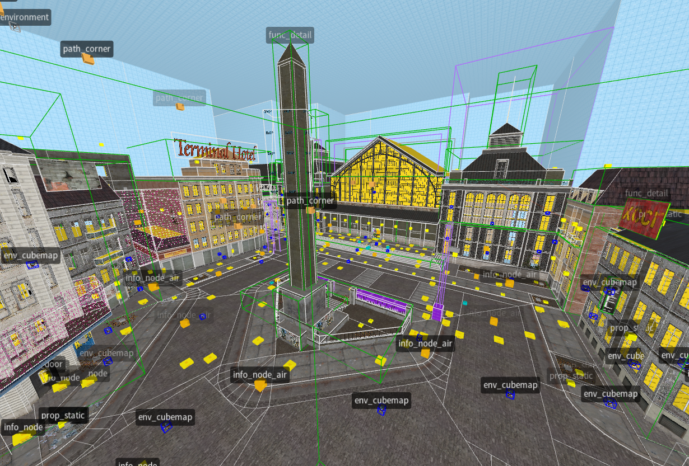
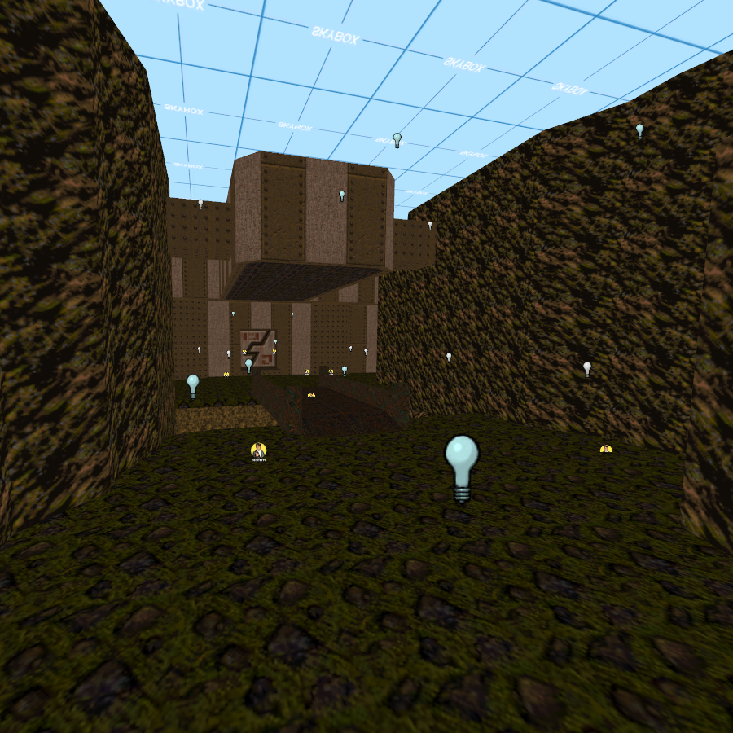

# T[rench]B[room] Utilities

<figcaption>
    Half-Life 2's <code>d1_trainstation_01</code> loaded in TrenchBroom.
</figcaption>

<figcaption>
    Quake's <code>e1m1</code> loaded in Hammer.
</figcaption>

## VMF Utilities
`vmf-utils` can export a Quake I/II .map to the .vmf format, or export a .vmf to the Quake II .map format.
Layers (called Visgroups in Hammer) and groups are also transfered between the two formats. Comments are transfered via the `_vmf_comments` keyvalue. Inputs and outputs are transfered from .vmf files by being incrementally prefixed with @<i>n</i>, the separators must all be present or the outputs will not transfer appropriately.

It can be included in the TrenchBroom compiling process, whether the .map is exported or not is not important, as `vmf-utils` treat omitted layers as disabled visgroups. As a reminder, `vmf-utils` does not modify the imported map.

### Usage :
`vmf-utils <path to a .map/.vmf> <path for the .map/.vmf> [additional parameters]`

### Optional parameters :
- `--fix-faces <path to a material folder` : "Fixes" the faces like Hammer does, require a path full of .tga files.
- `--round-values` : Rounds values like Hammer does.
- `--export-prefab` : Sets the `prefab` keyvalue to 1 in `versioninfo`, vmf-only.
- `--material-prefix <prefix>` : Prefixes every material with this.
- `--quake-axis-format` : When importing a .map, expect it to use the Quake format for texture axes.
- `--default-lightmap-scale <scale>` : When exporting a .vmf, set this lightmap scale for every face.
- `--fix-quake-lights` : Transforms any `light` keyvalue to `_light` for every light entity in order to "port" Quake-style lights.
- `--write-quake-lights-as-valve` : For `--fix-quake-lights`, writes the values as <b>255 255 255 `<value>`</b>.
- `--keep-special-keyvalues` : Keep every `_tb` and `_vmf` keyvalues.
- `--strip-material-folder` : Remove the folder from the material paths.
- `--no-atrib-write` : Don't write contents flags and values.

### What's next ?
Disabling any layer conversion, disabling groups exportation, only using the children groups, supporting post-L4D I/O, making the conversion faster...

## FGD Utilities
`fgd-utils` helps porting Source FGD files to a TrenchBroom-appropriate version.

### Usage :
`fgd-utils <path to an .fgd> [additional parameters]`

### Optional parameters :
- `--recurse-includes` : Exports files referenced in @include declarations.
- `--output-path <path to a folder>` : Output files in this folder, if it isn't specified then the current directory + "/out" is used.
- `--sprite-extension <extension>` : Replaces every instance of ".vmt" in iconsprite helpers to the specified extension, defaults to ".tga".
- `--model-extension <extension>` : Replaces every instance of ".mdl" in prop (`studioprop`, `lightprop`, `studio`) helpers to the specified extension, defaults to ".smd".

# TrenchBroom game configuration
In the `games/Source/` folder is included a `GameConfig.cfg` intended to be copied to `<TrenchBroom installation>/TrenchBroom/games/Source/` (the `Source/` folder must be created). It is simply an edit of the Quake II config to support loading exported Source .map files.
You can read the [TrenchBroom manual](https://trenchbroom.github.io/manual/latest/#game_configuration_files) for more information about game configurations.

The configuration expects a `materials/` folder filled with ".tga" files of the textures, this is not ideal and causes some crashes on large maps, but for now there is no better solution.

# Running
For Windows, there should be a release, for Linux, build it yourself.

# Building
Install [premake5](https://premake.github.io/) in the `premake/` directory. Help can be obtained with `premake5 --help`, `-arch` can be used to change the architecture, `-os` the os, and `-cc` the compiler.
As an example a VS2022 project can be obtained by running :
`premake5 vs2022 -os=windows -arch=x86_64`
And a Makefile can be obtained by running :
`./premake5 gmake -os=linux -arch=x86_64 -cc=gcc`